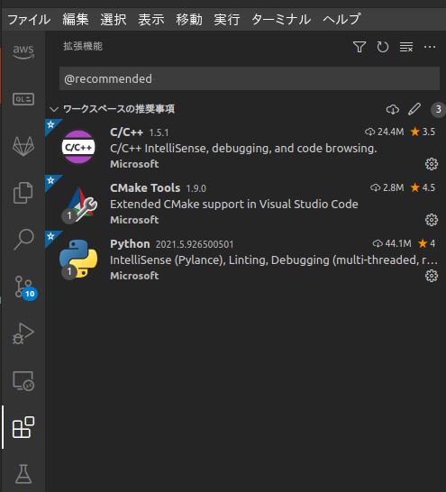

# boilerplate-typescript

TypeScript プロジェクト用のボイラープレート

## GitHub

[](https://github.com/kannkyo/boilerplate-typescript/actions/workflows/nodejs-ci.yml)
[](https://github.com/kannkyo/boilerplate-typescript/actions/workflows/nodejs-publish.yml)
[](https://github.com/kannkyo/boilerplate-typescript/actions/workflows/codeql-analysis.yml)

## 環境構築

### 前提条件

1. `node.js = "^16"` をインストール済みであること。
2. VSCode をインストール済みであること。

### 構築

#### VSCode

VSCode で本フォルダを開いて、拡張機能タブを開き、`@recommended` を入力して表示された推奨拡張機能を全てインストールします。



## 使い方

### パッケージインストール

パッケージをインストールする際は、以下のコマンドを実行します。

```bash
npm install
```

このコマンドは以下の処理を実行します。

1. install 処理
   - [package.json](package.json)の `dependencies` と `devDependencies` のパッケージをインストールします。
2. prepare 処理
   - git の設定ファイル [.git/config](.git/config)にコミットの際に自動的に実行するスクリプト [.husky/pre-commit](.husky/pre-commit)を設定します。

### ビルド

TypeScript のコードから ECMAScript のコードを生成する際は、以下のコマンドを実行します。

```bash
npm run build
```

このコマンドは以下の処理を実行します。

1. [src/](src/) ディレクトリのコードから ECMAScript のコードを生成して、 [dist/](dist/) ディレクトリに格納します。

### テスト

テストを実行する際は、以下のコマンドを実行します。

```bash
npm test
```

このコマンドは以下の処理を実行します。

1. [test/](test/) ディレクトリのテストを実行します。
2. テストレポートとして[junit.xml](junit.xml)を生成します。テストレポートは、JUnit 互換のフォーマットです。JUnit 互換レポートは、GitHub Actions や GitLab CI で可視化できます。
3. カバレッジレポートを[coverage/](coverage/)に格納します。

### リリース

パッケージを生成するか生成したパッケージをレジストリにプッシュする際は、以下のコマンドを実行します。

```bash
# package を生成する
npm pack

# package を生成し、registry にpushする
npm publish
```

`npm publish` コマンドは以下の処理を実行します。

1. prepack 処理
   - [SBOM (Software Bill Of Materials)](sbom.xml)を生成します。
2. pack 処理
   - [package.json](package.json)の `files` に定義されたファイルを同梱するパッケージを生成します。
3. publish 処理
   - 生成したパッケージをレジストリに送信します。

## メンテナンス

### コミット

`git commit` 実行時に自動的にテストを実行するように設定されています。

したがって、テストに失敗するソースコードはコミットできません。

### パッケージ追加

パッケージ `PACKAGE_NAME` を追加する際は、以下のコマンドを実行します。

```bash
# ソースコード用パッケージ追加
npm add PACKAGE_NAME

# 開発用パッケージ追加
npm add -D PACKAGE_NAME
```

### バージョン更新

バージョンを更新する際は、以下のコマンドを実行します。

```bash
npm run release
npm run push
```

このコマンドは以下の処理を実行します。

1. [Conventional Commits](https://www.conventionalcommits.org/ja/v1.0.0/) に基づくコミット履歴から、[CHANGELOG.md](CHANGELOG.md) を更新します。
2. [package.json](package.json)の `version` をインクリメントします。
3. 変更をコミットして、バージョン番号 `1.2.3` の頭に `v` を付けたタグ `v1.2.3` を作成します。
4. 作成したタグとブランチをリポジトリにプッシュします。

## Thanks

- gitlab issue and merge request templates from <https://github.com/tokyo-metropolitan-gov/covid19> as MIT
